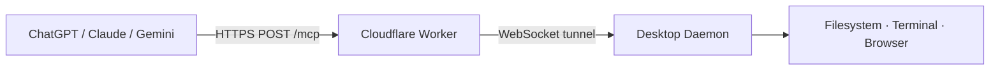

# DeckAgent 🃏

> Self-hosted MCP bridge — give ChatGPT, Claude, and Gemini hands on your computer.

Deploy a Cloudflare Worker, run a desktop daemon, paste one URL into any web AI. Your AI can now **read files, run terminal commands, and control a browser** on your machine — fully self-hosted, no third-party relay.



## Quick Start

```bash
npx deckagent setup     # one-command setup wizard
```

Then add the printed Worker URL as a custom MCP connector in ChatGPT, Claude, or Gemini.

### Manual Setup

```bash
# 1. Clone and build
git clone https://github.com/mosesman831/deckagent.git
cd deckagent
npm install && npm run build

# 2. Deploy the Worker (requires a Cloudflare account)
cd packages/cloudflare-worker
npx wrangler login
npx wrangler deploy
npx wrangler secret put API_TOKEN

# 3. Register your device
curl -X POST https://your-worker.workers.dev/api/devices \
  -H "Authorization: Bearer <token>" \
  -H "Content-Type: application/json" \
  -d '{"device_id":"<uuid>","name":"My Machine","token":"<device-token>"}'

# 4. Create config
mkdir -p ~/.deckagent
cat > ~/.deckagent/config.json << 'EOF'
{
  "device_id": "<uuid>",
  "token": "<device-token>",
  "worker_url": "https://your-worker.workers.dev",
  "device_name": "My Machine",
  "heartbeat_interval": 15,
  "log_level": "info"
}
EOF

# 5. Start the daemon
npx deckagent daemon --foreground
```

## Features

- **Self-hosted** — your Worker, your Cloudflare account, your data
- **No relay** — direct WebSocket tunnel via Cloudflare Durable Objects
- **20 tools** across filesystem, terminal, browser, environment, and snapshots
- **Workspaces** — project-scoped relative paths (`deckagent workspace use`)
- **MCP resources** — policy, audit, workspace, devices via `resources/read`
- **Snapshots / undo** — automatic backups before edits; `restore_snapshot`
- **Secrets vault** — inject tokens into commands without model-visible values
- **Budgets** — hourly caps on tool calls, shell time, and bytes written
- **Local control UI** — `http://127.0.0.1:9150` (`deckagent ui`)
- **SSE streaming** — `execute_command_stream` with `Accept: text/event-stream`
- **Policy engine** — allow/block directories, allowlist/blocklist commands, read-only, confirmation
- **Cross-platform** — macOS & Linux (LaunchAgent/systemd); Windows via scheduled task at logon

## How It Works

```
Web AI (ChatGPT/Claude/Gemini)
    │
    ▼  POST /mcp (Bearer token, JSON-RPC 2.0)
Cloudflare Worker
    │
    ▼  WebSocket tunnel (Durable Object)
Desktop Daemon
    │
    ├─── read_file / write_file / edit_file / search_files
    ├─── execute_command / list_processes / kill_process
    └─── browser_navigate / browser_screenshot / browser_click
```

The Worker and daemon communicate through a Durable Object that acts as both the WebSocket endpoint and HTTP MCP handler. Tool calls arrive as JSON-RPC over HTTP, get forwarded through the DO's WebSocket to the daemon, executed locally, and the result flows back — **all without relay servers, polling, or KV reads at runtime**.

## Tools

| Category | Tools |
|----------|-------|
| **Filesystem** | `read_file`, `write_file`, `edit_file`, `search_files`, `list_directory`, `create_directory`, `move_file`, `get_file_info`, `read_multiple_files` |
| **Terminal** | `execute_command`, `execute_command_stream`, `list_processes`, `kill_process` |
| **Browser** | `browser_navigate`, `browser_screenshot`, `browser_click`, `browser_evaluate` |
| **Snapshots** | `list_snapshots`, `restore_snapshot` |
| **Environment** | `get_environment` |

## Security

- Daemon runs as a **normal user process** — never root
- All traffic is **HTTPS / WSS** — no open inbound ports on your machine (Worker tunnel is outbound-only)
- Local extension socket binds **`127.0.0.1:9147` only**
- Tool execution is gated by a local **`policy.json`**:
  - `allowed_directories` — restrict where the AI can read/write
  - `blocked_commands` — block dangerous shell patterns (normalized matching)
  - `read_only` — disable all mutation tools
  - `require_confirmation` — blocks until you approve in a local browser page (`http://127.0.0.1:9148/confirm/...`); remote `_preconfirmed` is ignored
  - `allow_browser` / `allow_terminal` — feature gates
  - `max_file_read_size` — caps file reads
- The Cloudflare Worker uses Bearer token auth — treat `API_TOKEN` and device tokens as secrets
- See [SECURITY.md](SECURITY.md) for reporting and operator hardening

## Comparison

| Feature | DeckAgent | Desktop Commander |
|---------|-----------|-------------------|
| Hosting | **Self-hosted** (your CF Worker) | Commercial relay |
| Data path | Direct Worker ↔ your machine | Routes through vendor servers |
| Source | **Open source (MIT)** | Closed source / freemium |
| Cost | **Free** (Cloudflare free tier) | Paid for remote/team use |
| AI support | ChatGPT, Claude, Gemini **web** | Primarily Claude Desktop |
| Policy control | Local `policy.json` (you own it) | Cloud-controlled |
| Browser automation | Built-in browser tools | Limited |

## Configuration

All config lives in `~/.deckagent/`:

```
~/.deckagent/
├── config.json      # device_id, token, worker_url, workspace, preferences
├── policy.json      # allowed dirs, blocked commands, confirmations, budgets
└── logs/
    ├── deckagent-YYYY-MM-DD.log
    └── audit.jsonl
```

### Workspace (project scope)

```bash
deckagent workspace use ~/code/myapp   # scope relative paths + outside-tree confirmation
deckagent workspace status
deckagent workspace clear
```

Agents see `workspace_root` / `workspace_name` from `get_environment`, and can read `deckagent://workspace` via MCP resources.

## v2 Browser Extension 🧩

> **⚠️ Experimental.** The v2 extension works with the 4 sites listed below but each AI's internal API can change without notice. Use at your own risk.

DeckAgent v2 is a Chrome extension that lets **more AI web chats** use your daemon — not just ChatGPT/Claude. It intercepts fetch calls on:

| Site | Adapter | Tested |
|------|---------|--------|
| [DeepSeek](https://chat.deepseek.com) | ✅ | 23 unit + E2E |
| [Qwen](https://chat.qwenlm.ai) | ✅ | 48 unit + E2E |
| [Kimi](https://kimi.com) | ✅ | 35 unit + E2E |
| [Z.ai (GLM)](https://z.ai/chat) | ✅ | 44 unit + E2E |

### How it works

```
AI Web Chat (DeepSeek/Qwen/Kimi/Z.ai)
  │
  ▼  fetch() intercepted by extension
Content Script (monkey-patches window.fetch)
  │
  ├── adapter.transformRequest → injects tool system prompt
  │
  ▼  modified request sent to AI
AI API responds
  │
  └── adapter.transformResponse → detects <<<TOOL>>> calls
        │
        ▼  sent to background WebSocket
      DeckAgent Daemon  →  executes tool  →  result appended
```

### Install

```bash
# 1. Build the extension
cd packages/v2-extension
npm install
npm run build

# 2. Load in Chrome
#    chrome://extensions → Enable Developer Mode → Load unpacked
#    Select: packages/v2-extension/.output/chrome-mv3/

# 3. Make sure your DeckAgent daemon is running
```

### Usage

1. Start your DeckAgent daemon (v1 must be running on your machine)
2. Open any supported AI chat (DeepSeek, Qwen, Kimi, or Z.ai)
3. Paste the DeckAgent system prompt (below) into a new message
4. Start asking the AI to use tools — watch it output `<<<TOOL>>>` blocks
5. The extension intercepts, executes on your machine, and injects the result

### System Prompt

Paste this into your AI chat as the first message (or use [`system_prompt.md`](system_prompt.md) for the full guide):

> You have access to a local machine through DeckAgent. You can use these tools by outputting a JSON block with the format: `<<<TOOL>>>{"name":"tool_name","args":{...}}<<<END>>>`. Available tools: read_file, write_file, edit_file, search_files, list_directory, execute_command, get_environment, browser_navigate, browser_screenshot.

Tool results appear in a page overlay and are queued into the next chat request. Keep the daemon running with the local tunnel on port `9147`.

### Disclaimer

> **This extension intercepts network requests from supported AI chat sites.**
> - It only reads requests to known API endpoints — no other traffic is touched.
> - It does **not** collect or transmit any data to third parties.
> - The AI chat sites may update their APIs at any time, potentially breaking the extension.
> - Tested against 191 unit/integration/stress tests. Not tested against a full Chrome Web Store review.

## Named Cloudflare tunnels

For local development you can expose `wrangler dev` (port 8787) with a Cloudflare Tunnel instead of deploying to workers.dev:

```bash
# Terminal 1 — local Worker
cd packages/cloudflare-worker
npx wrangler dev --port 8787

# Terminal 2 — quick tunnel (ephemeral trycloudflare.com URL)
deckagent tunnel
# or: cloudflared tunnel --url http://127.0.0.1:8787
```

`deckagent tunnel` checks that `cloudflared` is installed, starts a quick tunnel by default, and reminds you of the MCP URL (`https://<tunnel-host>/mcp`) plus the API token from `~/.deckagent/config.json`.

### Persistent named tunnel

```bash
cloudflared tunnel login
cloudflared tunnel create deckagent-dev
cloudflared tunnel route dns deckagent-dev deckagent.example.com
deckagent tunnel --name deckagent-dev
```

Configure ingress in `~/.cloudflared/config.yml` so the named tunnel forwards to `http://127.0.0.1:8787`. Production setups should still prefer a deployed Worker on `*.workers.dev` (or a custom domain on the Worker) — tunnels are ideal for local/dev or when you need a stable hostname in front of `wrangler dev`.

### Publishing the CLI (`npx deckagent`)

```bash
npm run bundle:cli   # copies Worker sources into packages/cli/assets/worker
npm run build
# publish @deckagent/cli (includes assets/ + depends on @deckagent/desktop-daemon)
```

## Development

```bash
npm install
npm run build

# Local testing (no Cloudflare account needed)
cd packages/cloudflare-worker
npx wrangler dev --port 8787
# Then point your daemon at http://localhost:8787
# Daemon must connect to /tunnel?device_id=<your-device-id>

# Optional: enable browser tools
npx playwright install chromium
# Set allow_browser: true in ~/.deckagent/policy.json or pass --enable-browser

# v2 extension testing
cd packages/v2-extension
npm install
npm run build                    # builds to .output/chrome-mv3/
npm test                         # unit + adapter tests
```

### Connector smoke matrix

Against a live Worker (daemon online for tool steps):

```bash
cd packages/cloudflare-worker
DECKAGENT_URL=https://your-worker.workers.dev \
DECKAGENT_TOKEN=your-api-token \
npm run smoke
# or: npx tsx scripts/connector-smoke.ts --url … --token …
```

Runs initialize → notifications/initialized → tools/list → prompts → resources →
`get_environment` → `list_directory /tmp` for client profiles `cursor`,
`claude-desktop`, and `mcpplayground`. Prints a PASS/FAIL matrix; exits non-zero on failure.

Five packages in an npm workspace:

| Package | Description |
|---------|-------------|
| `packages/mcp-server` | Pure MCP tool implementations (zero-dependency) |
| `packages/cloudflare-worker` | Worker endpoint, DO tunnel, device API |
| `packages/desktop-daemon` | WebSocket client, policy engine, tool executor |
| `packages/cli` | `deckagent` setup wizard CLI |
| `packages/v2-extension` | Chrome extension for DeepSeek/Qwen/Kimi/Z.ai |

## License

MIT — see [LICENSE](LICENSE).

## Roadmap

- Next product wave (workspaces, resources, snapshots, secrets, UI, budgets, SSE): [`docs/WAVE3_FEATURE_SPEC.md`](docs/WAVE3_FEATURE_SPEC.md)
- Hard security enforcement wave (profiles, trusted/denied/protected paths, tools/list filtering): [`docs/SECURITY_ENFORCEMENT_SPEC.md`](docs/SECURITY_ENFORCEMENT_SPEC.md)
