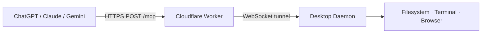

# DeckAgent 🃏

> Self-hosted MCP bridge — give ChatGPT, Claude, and Gemini hands on your computer.

Deploy a Cloudflare Worker, run a desktop daemon, paste one URL into any web AI. Your AI can now **read files, run terminal commands, and control a browser** on your machine — fully self-hosted, no third-party relay.



## Quick Start

```bash
npx deckagent setup     # one-command setup wizard
```

Then add the printed Worker URL as a custom MCP connector in ChatGPT, Claude, or Gemini.

### Manual Setup

```bash
# 1. Clone and build
git clone https://github.com/mosesman831/deckagent.git
cd deckagent
npm install && npm run build

# 2. Deploy the Worker (requires a Cloudflare account)
cd packages/cloudflare-worker
npx wrangler login
npx wrangler deploy
npx wrangler secret put API_TOKEN

# 3. Register your device
curl -X POST https://your-worker.workers.dev/api/devices \
  -H "Authorization: Bearer <token>" \
  -H "Content-Type: application/json" \
  -d '{"device_id":"<uuid>","name":"My Machine","token":"<device-token>"}'

# 4. Create config
mkdir -p ~/.deckagent
cat > ~/.deckagent/config.json << 'EOF'
{
  "device_id": "<uuid>",
  "token": "<device-token>",
  "worker_url": "https://your-worker.workers.dev",
  "device_name": "My Machine",
  "heartbeat_interval": 15,
  "log_level": "info"
}
EOF

# 5. Start the daemon
npx deckagent daemon --foreground
```

## Features

- **Self-hosted** — your Worker, your Cloudflare account, your data
- **No relay** — direct WebSocket tunnel via Cloudflare Durable Objects
- **18 tools** across filesystem, terminal, browser, and environment
- **Policy engine** — allow/block directories, block dangerous commands, read-only mode, confirmation gates
- **Zero configuration** — `deckagent setup` handles everything
- **Cross-platform** — macOS, Linux, Windows

## How It Works

```
Web AI (ChatGPT/Claude/Gemini)
    │
    ▼  POST /mcp (Bearer token, JSON-RPC 2.0)
Cloudflare Worker
    │
    ▼  WebSocket tunnel (Durable Object)
Desktop Daemon
    │
    ├─── read_file / write_file / edit_file / search_files
    ├─── execute_command / list_processes / kill_process
    └─── browser_navigate / browser_screenshot / browser_click
```

The Worker and daemon communicate through a Durable Object that acts as both the WebSocket endpoint and HTTP MCP handler. Tool calls arrive as JSON-RPC over HTTP, get forwarded through the DO's WebSocket to the daemon, executed locally, and the result flows back — **all without relay servers, polling, or KV reads at runtime**.

## Tools

| Category | Tools |
|----------|-------|
| **Filesystem** | `read_file`, `write_file`, `edit_file`, `search_files`, `list_directory`, `create_directory`, `move_file`, `get_file_info`, `read_multiple_files` |
| **Terminal** | `execute_command`, `execute_command_stream`, `list_processes`, `kill_process` |
| **Browser** | `browser_navigate`, `browser_screenshot`, `browser_click`, `browser_evaluate` |
| **Environment** | `get_environment` |

## Security

- Daemon runs as a **normal user process** — never root
- All traffic is **HTTPS / WSS** — no open inbound ports on your machine
- Tool execution is gated by a local **`policy.json`**:
  - `allowed_directories` — restrict where the AI can read/write
  - `blocked_commands` — prevent dangerous shell commands
  - `read_only` — disable all mutation tools
  - `require_confirmation` — require user approval for destructive actions
- The Cloudflare Worker uses Bearer token auth — your API token is the only key

## Comparison

| Feature | DeckAgent | Desktop Commander |
|---------|-----------|-------------------|
| Hosting | **Self-hosted** (your CF Worker) | Commercial relay |
| Data path | Direct Worker ↔ your machine | Routes through vendor servers |
| Source | **Open source (MIT)** | Closed source / freemium |
| Cost | **Free** (Cloudflare free tier) | Paid for remote/team use |
| AI support | ChatGPT, Claude, Gemini **web** | Primarily Claude Desktop |
| Policy control | Local `policy.json` (you own it) | Cloud-controlled |
| Browser automation | Built-in browser tools | Limited |

## Configuration

All config lives in `~/.deckagent/`:

```
~/.deckagent/
├── config.json      # device_id, token, worker_url, preferences
├── policy.json      # allowed dirs, blocked commands, confirmations
└── logs/
    └── deckagent-YYYY-MM-DD.log
```

## Development

```bash
npm install
npm run build

# Local testing (no Cloudflare account needed)
cd packages/cloudflare-worker
npx wrangler dev --port 8787
# Then point your daemon at http://localhost:8787
```

Four packages in an npm workspace:

| Package | Description |
|---------|-------------|
| `packages/mcp-server` | Pure MCP tool implementations (zero-dependency) |
| `packages/cloudflare-worker` | Worker endpoint, DO tunnel, device API |
| `packages/desktop-daemon` | WebSocket client, policy engine, tool executor |
| `packages/cli` | `deckagent` setup wizard CLI |

## License

MIT — see [LICENSE](LICENSE).
